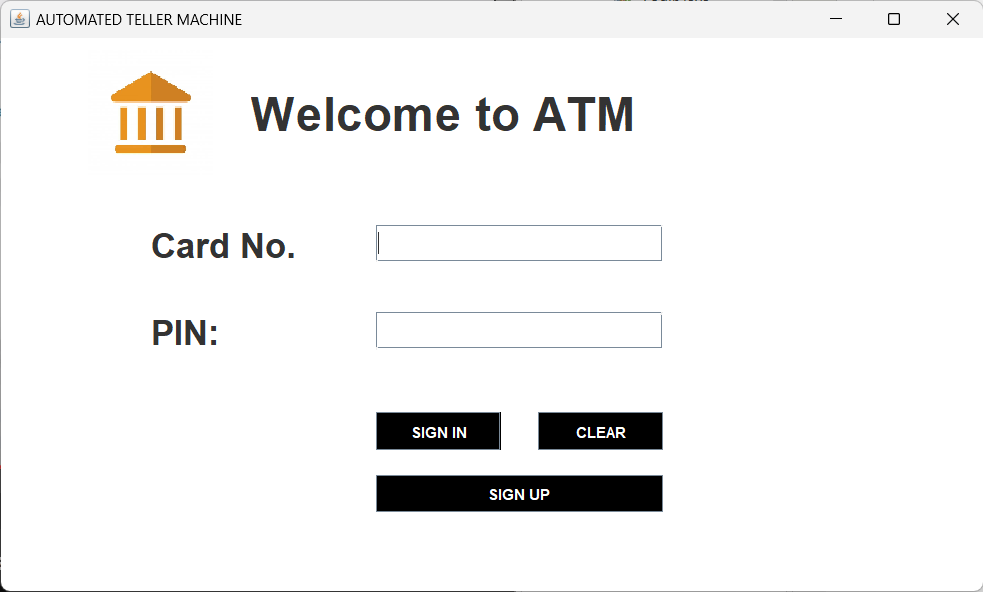
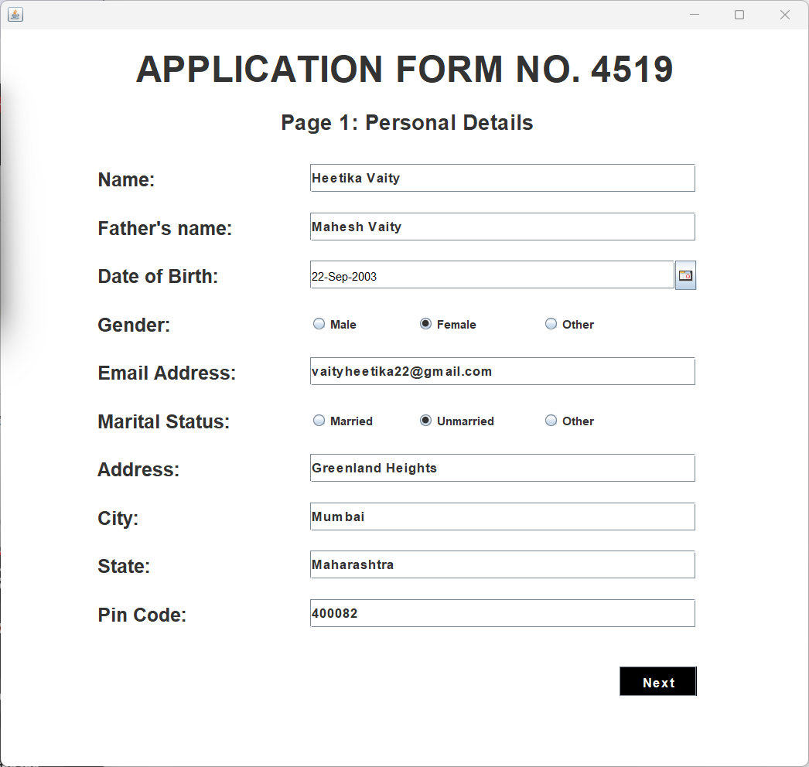
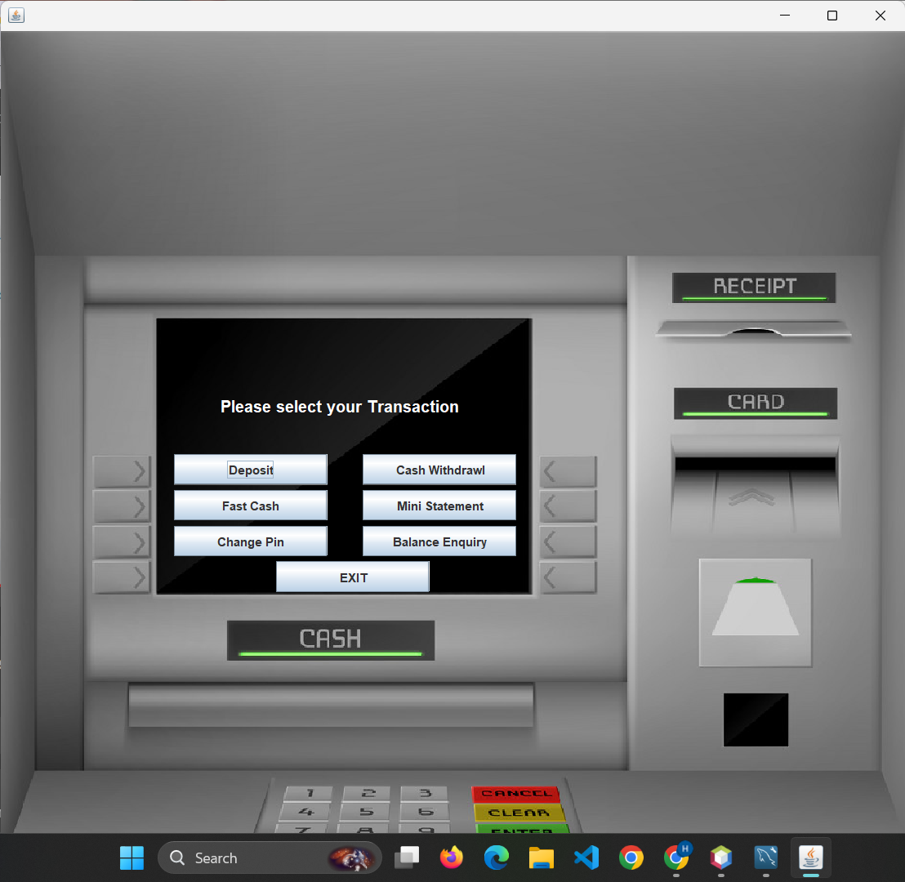

# ATM-Simulator

## Introduction
The ATM-Simulator is a desktop application developed using Java, Java Swing, AWT, and MySQL. This application demonstrates Object-Oriented Programming (OOP) concepts and provides a comprehensive interface for simulating ATM operations. The system allows users to create new accounts, perform transactions, and manage their banking activities efficiently.

## Features
- **Account Creation**: Users can fill out an application form to create a new bank account.
- **Account Number and PIN Generation**: The system automatically generates a unique account number and PIN for new accounts.
- **Deposit and Withdrawal**: Users can deposit and withdraw money from their accounts.
- **Fast Cash**: Quick cash withdrawal feature.
- **Mini Statement**: View a mini statement of recent transactions.
- **PIN Change**: Users can change their account PIN.
- **Balance Enquiry**: Check the current account balance.

## Technologies Used
- **Java**: Core programming language.
- **Java Swing and AWT**: For building the graphical user interface (GUI).
- **Java JDBC**: For database connectivity.
- **MySQL**: Database management system.

## Installation
1. **Clone the repository**:
   ```bash
   git clone https://github.com/yourusername/atm-simulator.git
   cd atm-simulator
   ```
2. **Set up the database**:

- Install MySQL and create a database named atm_simulator.
- Execute the provided SQL script (database_queries.txt) to create the required tables.

3. **Create a new project**:

- Open your preferred IDE (Eclipse or NetBeans).
- Create a new Java project.
- Add the Java files from the repository to the src folder under the same package.

4. **Add icons**:

- Copy the icons from the icons folder in the repository to the appropriate directory in your project.
  
5. **Configure database connection**:

- Open Conn.java and update the database connection details (URL, username, password).

6. **Compile and run the application**:

- Compile the Java files in your IDE.
- Run the Login class.

##Usage

1. **Launch the application**:

- Run the Login class.

2. **Create a new account**:

- Fill out the application form with the required details and submit.

3. **Login**:

- Use the generated account number and PIN to log in.

4. **Perform transactions**:

- Navigate through the menu to deposit, withdraw, check balance, view mini statements, or change PIN.

##Screenshots

- Main Page


- Application Form


- Transaction Window


Explore more screenshots of pages in the screenshots folder


